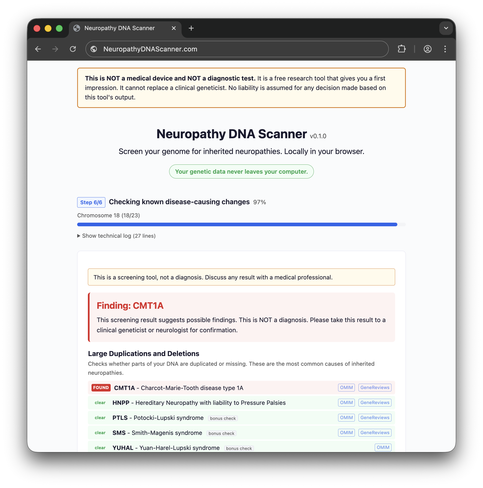

# Neuropathy DNA Scanner

A browser-based tool that screens whole-genome sequencing (WGS) data for inherited neuropathies. It reads BAM and CRAM files directly in the browser using Rust compiled to WebAssembly. No data leaves your computer.



## What it does

The tool runs two independent analyses on your genome data:

**Structural variant detection** examines read depth across chromosome 17p to identify large duplications and deletions. It detects CMT1A (PMP22 duplication), HNPP (PMP22 deletion), Potocki-Lupski syndrome (RAI1 duplication), Smith-Magenis syndrome (RAI1 deletion), and YUHAL syndrome (contiguous PMP22+RAI1 duplication). The algorithm compares PMP22 region depth against a chr2 autosomal control, then scans for boundary breakpoints using a sliding window.

**Point mutation screening** checks 22,748 known pathogenic single-nucleotide variants across 165 neuropathy-associated genes. For each variant position in the catalog, the tool queries the alignment file, extracts the base from each overlapping read using CIGAR-aware position mapping, and counts reference vs. alternate alleles. Variants are classified as heterozygous, homozygous, hemizygous (chrX in males), or carrier (heterozygous recessive) based on allele balance, strand distribution, base quality, and mapping quality thresholds.

The variant catalog is generated from ClinVar (pathogenic and likely pathogenic variants, review status >= 1 star) filtered to the Genomics England PanelApp hereditary neuropathy gene panel. It is embedded in the WebAssembly binary at build time.

## How it works

The entire analysis runs in the browser. There is no server-side processing.

1. The user selects a BAM or CRAM file, its index (BAI or CRAI), and optionally a reference FASTA (GRCh38 or GRCh37, auto-detected from the header).
2. JavaScript reads the index to compute which byte ranges of the alignment file are needed.
3. Using `File.slice()`, only the relevant byte ranges are read from disk (typically <1% of a 50 GB CRAM).
4. The byte ranges are passed to the WebAssembly module, which uses [noodles](https://github.com/zaeleus/noodles) to parse the BAM/CRAM records.
5. Structural variant analysis runs first (depth ratio + boundary scan on chr17 and chr2).
6. Point mutation screening runs chromosome-by-chromosome, loading one chromosome's reference sequence and CRAM data at a time to bound memory usage.
7. Results are rendered in Vue 3 as they arrive.

For CRAM files, the reference FASTA is needed because CRAM encodes sequences as differences from the reference. The tool scans the FASTA once to build an in-memory index, then reads chromosome sequences on demand.

BAM files work without a reference FASTA because they store full sequences.

## What it does not do

- **No VCF support.** The tool reads raw alignments (BAM/CRAM), not variant call files. It does its own pileup-based genotyping from read data.
- **No indel detection.** The current pileup engine handles single-nucleotide variants only. The 10,312 insertions and deletions in the ClinVar catalog are listed but not yet screened. This is a planned addition.
- **No novel variant discovery.** Only variants in the embedded ClinVar catalog are checked. Mutations not yet reported to ClinVar will not be found.
- **Not a diagnostic tool.** This is a screening tool that gives a first impression. Positive findings should be confirmed by a clinical geneticist.

## Architecture

```
cmt1a-detector/
  core/           Rust library: depth analysis, boundary detection,
                  pileup classification, variant catalog, interpretation
  wasm/           WebAssembly bindings (wasm-bindgen)
  web/            Vue 3 + TypeScript frontend
  tools/          CLI tools: catalog generator, fixture builder
  vendor/         Patched noodles-cram (see below)
  scripts/        Reference genome download script
```

The core library has no WASM dependencies and is fully testable with `cargo test`. The WASM crate wraps it with `wasm-bindgen` exports. The Vue frontend communicates with WASM through typed JavaScript bindings.

### Single source of truth

The variant catalog, gene panel, syndrome definitions, and screening manifest all originate from Rust code. The Vue frontend reads them from WASM exports at runtime. There are no hardcoded gene lists or variant positions in the TypeScript code.

### Vendored noodles-cram

The tool vendors a patched copy of [noodles-cram 0.92.0](https://crates.io/crates/noodles-cram/0.92.0). The patches fix:

1. **Huffman byte codec** -- the upstream `decode_take` for Huffman-encoded quality scores was unimplemented (`todo!()`), causing panics on Sentieon-produced CRAMs.
2. **Missing reference handling** -- the upstream panicked when querying a CRAM with reads on chromosomes whose reference wasn't loaded. The patch returns `Ok(None)` so records can be iterated for positions without full sequence decoding.
3. **Sequence iterator** -- an infinite loop when emitting placeholder bases for records without a reference sequence.
4. **Query optimization** -- skip containers before the query range without seeking to them.

See `vendor/noodles-cram/PATCHES.md` for details. These patches should be removed once upstream noodles publishes fixes.

## Building

### Prerequisites

- Rust (stable, with `wasm32-unknown-unknown` target)
- wasm-pack
- Node.js 18+
- samtools (for fixture generation and reference indexing)

### Build steps

```sh
# 1. Build the WASM module
cd wasm
wasm-pack build --target web --release
cp pkg/* ../web/public/pkg/

# 2. Install frontend dependencies and start dev server
cd ../web
npm install
npm run dev
```

### Running tests

```sh
# Rust unit + integration tests (174 tests)
cargo test -p nds-core

# CRAM fixture tests require the GRCh38 reference:
./scripts/download-reference.sh
cargo run --release --bin build_test_fixtures -- \
  --catalog core/data/catalog.json \
  --reference ref/GRCh38_no_alt_plus_hs38d1.fna \
  --output-dir fixtures
```

### Regenerating the variant catalog

```sh
# Downloads current ClinVar VCF + PanelApp panel, filters, and writes catalog.json
cargo run --release --bin build_catalog -- \
  --output core/data/catalog.json
```

## Technical showcase

This project demonstrates that Rust + WebAssembly can handle genomics workloads that were traditionally server-only:

- Parsing 50+ GB CRAM files in the browser using sparse byte-range reads
- CIGAR-aware pileup genotyping across 22,748 positions without a variant caller
- Reference-based CRAM decoding with a 3 GB FASTA indexed on the fly
- Per-chromosome streaming to bound memory usage in a single browser tab
- Sex detection from CRAI alignment statistics for hemizygous chrX calling

The approach proves that privacy-sensitive genomic analysis can run entirely client-side with acceptable performance (under 2 minutes for a full 30x WGS scan on consumer hardware).

## License

MIT License, [Funktionslust GmbH, Wolfgang Stark](https://funktionslust.digital)
